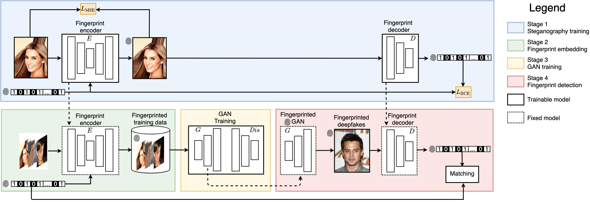

# Artificial GAN Fingerprints

### [Artificial Fingerprinting for Generative Models: Rooting Deepfake Attribution in Training Data](https://arxiv.org/pdf/2007.08457.pdf)
[Ning Yu](https://ningyu1991.github.io/)\*, [Vladislav Skripniuk](https://www.linkedin.com/in/vladislav-skripniuk-8a8891143/?originalSubdomain=ru)\*, [Sahar Abdelnabi](https://s-abdelnabi.github.io/), [Mario Fritz](https://cispa.saarland/group/fritz/)<br>
*Equal contribution<br>
ICCV 2021 Oral

### [paper](https://arxiv.org/pdf/2007.08457.pdf) | [project](https://ningyu1991.github.io/projects/ArtificialGANFingerprints.html) | [poster](https://ningyu1991.github.io/homepage_files/poster_ArtificialGANFingerprints.pdf) | [video](https://www.youtube.com/watch?v=j8bcOHhu4Lg&t=12s)



## Abstract
Photorealistic image generation has reached a new level of quality due to the breakthroughs of generative adversarial networks (GANs). Yet, the dark side of such deepfakes, the malicious use of generated media, raises concerns about visual misinformation. While existing research work on deepfake detection demonstrates high accuracy, it is subject to advances in generation techniques and adversarial iterations on detection countermeasure techniques. Thus, we seek a proactive and sustainable solution on deepfake detection, that is agnostic to the evolution of generative models, by introducing artificial fingerprints into the models. 

Our approach is simple and effective. We first embed artificial fingerprints into training data, then validate a surprising discovery on the transferability of such fingerprints from training data to generative models, which in turn appears in the generated deepfakes. Experiments show that our fingerprinting solution (1) holds for a variety of cutting-edge generative models, (2) leads to a negligible side effect on generation quality, (3) stays robust against image-level and model-level perturbations, (4) stays hard to be detected by adversaries, and (5) converts deepfake detection and attribution into trivial tasks and outperforms the recent state-of-the-art baselines. Our solution closes the responsibility loop between publishing pre-trained generative model inventions and their possible misuses, which makes it independent of the current arms race.

## Prerequisites
- Linux
- NVIDIA GPU + CUDA 10.0 + CuDNN 7.5
- Python 3.6
- To install the other Python dependencies, run `pip3 install -r requirements.txt`
  
## Datasets
- We experiment on six datasets. Download and unzip images into a folder.
  - [CelebA aligned and cropped images](https://drive.google.com/drive/folders/0B7EVK8r0v71pTUZsaXdaSnZBZzg?resourcekey=0-rJlzl934LzC-Xp28GeIBzQ). All images for fingerprint autoencoder training. 150k/50k images for [ProGAN PyTorch](https://github.com/jeromerony/Progressive_Growing_of_GANs-PyTorch), [StyleGAN](https://github.com/NVlabs/stylegan), and [StylegGAN2](https://github.com/NVlabs/stylegan2) training/evaluation.
  - [LSUN Bedroom](https://github.com/fyu/lsun). All images for fingerprint autoencoder training. 50k/50k images for [ProGAN PyTorch](https://github.com/jeromerony/Progressive_Growing_of_GANs-PyTorch), [StyleGAN](https://github.com/NVlabs/stylegan), and [StylegGAN2](https://github.com/NVlabs/stylegan2) training/evaluation.
  - [LSUN Cat](http://dl.yf.io/lsun/objects/). All images for fingerprint autoencoder training. 50k/50k images for [ProGAN TensorFlow](https://github.com/tkarras/progressive_growing_of_gans), [StyleGAN](https://github.com/NVlabs/stylegan), and [StylegGAN2](https://github.com/NVlabs/stylegan2) training/evaluation.
  - [CIFAR-10](https://www.cs.toronto.edu/~kriz/cifar.html). All images for fingerprint autoencoder training and [BigGAN](https://github.com/ajbrock/BigGAN-PyTorch) training/evaluation.
  - [CycleGAN horse2zebra](https://github.com/taesungp/contrastive-unpaired-translation/blob/master/docs/datasets.md). All zebra training images for fingerprint autoencoder training. All the original training/testing splits for [CUT](https://github.com/taesungp/contrastive-unpaired-translation) training/evaluation.
  - [AFHQ Cat and Dog](https://github.com/clovaai/stargan-v2/blob/master/README.md#animal-faces-hq-dataset-afhq). All Dog training images for fingerprint autoencoder training. All the original training/testing splits for [CUT](https://github.com/taesungp/contrastive-unpaired-translation) training/evaluation.

## Fingerprint autoencoder training
- Run, e.g.,
  ```
  python3 train.py \
  --data_dir /path/to/images/ \
  --use_celeba_preprocessing \
  --image_resolution 128 \
  --output_dir /path/to/output/ \
  --fingerprint_length 100 \
  --batch_size 64
  ```
  where
  - `use_celeba_preprocessing` needs to be active if and only if using CelebA aligned and cropped images.
  - `image_resolution` indicates the image resolution for training. All the images in `data_dir` is center-cropped according to the shorter side and then resized to this resolution. When `use_celeba_preprocessing` is active, `image_resolution` has to be set as 128.
  - `output_dir` contains model snapshots, image snapshots, and log files. For model snapshots, `*_encoder.pth` and `*_decoder.pth` correspond to the fingerprint encoder and decoder respectively.

## Pre-trained fingerprint autoencoder models
- Our pre-trained autoencoder models can be downloaded from:
  - [CelebA 128x128](https://drive.google.com/drive/folders/1C_gdRlyVsS1XHByclaBzRJ8t27fV_rDY?usp=sharing)
  - [LSUN Bedroom 128x128](https://drive.google.com/drive/folders/1_5jD5vvblmU51y87FXwoFE8DNixsG8-7?usp=sharing)
  - [LSUN Cat 256x256](https://drive.google.com/drive/folders/1LhMcUIcEi-m7XHUGhB9roYJ8r1xdszah?usp=sharing)
  - [CIFAR10 32x32](https://drive.google.com/drive/folders/19YybLhOhfhEGlr0_1Ih4-B9ZMXz5aToJ?usp=sharing)
  - [horse2zebra 256x256](https://drive.google.com/drive/folders/12AZ6de6Zx9XIRMHe93TnsbreknN14vhA?usp=sharing)
  - [AFHQ cat2dog 256x256](https://drive.google.com/drive/folders/1k5Ezb2Do5oBiN-Ei6P0SY6CJfIsJXMX9?usp=sharing)

## Fingerprint embedding and detection
- For **fingerprint embedding**, run, e.g.,
  ```
  python3 embed_fingerprints.py \
  --encoder_path /path/to/encoder/ \
  --data_dir /path/to/images/ \
  --use_celeba_preprocessing \
  --image_resolution 128 \
  --output_dir /path/to/output/ \
  --identical_fingerprints \
  --batch_size 64
  ```
  where
  - `use_celeba_preprocessing` needs to be active if and only if using CelebA aligned and cropped images.
  - `image_resolution` indicates the image resolution for fingerprint embedding. All the images in `data_dir` is center-cropped according to the shorter side and then resized to this resolution. **It should match the input resolution for the well-trained encoder read from `encoder_path`**. When `use_celeba_preprocessing` is active, `image_resolution` has to be set as 128.
  - `output_dir` contains embedded fingerprint sequence for each image in `embedded_fingerprints.txt` and fingerprinted images in `fingerprinted_images/`.
  - `identical_fingerprints` needs to be active if and only if all the images need to be fingerprinted with the same fingerprint sequence. 
  
- For **fingerprint detection**, run, e.g.,
  ```
  python3 detect_fingerprints.py \
  --decoder_path /path/to/decoder/ \
  --data_dir /path/to/fingerprinted/images/ \
  --image_resolution 128 \
  --output_dir /path/to/output/ \
  --batch_size 64
  ```
  where
  - `output_dir` contains detected fingerprint sequence for each image in `detected_fingerprints.txt`.
  - `image_resolution` indicates the image resolution for fingerprint detection. All the images in `data_dir` is center-cropped according to the shorter side and then resized to this resolution. **It should match the input resolution for the well-trained decoder read from `decoder_path`**.

## Generative models trained on fingerprinted datasets
- Our fingerprinting solution is agnostic to the applications of generative models and is plug-and-play without re-touching their code. Using the corresponding GitHub repositories, our pre-trained generative models can be downloaded from the links below, accompanied with their FID for fidelity and fingerprint bitwise accuracy:
  | Training code                                                                       | Our pre-trained model                                                                                                                               |  FID  | Fgpt bit acc |
  |-------------------------------------------------------------------------------------|-----------------------------------------------------------------------------------------------------------------------------------------------------|:-----:|:------------:|
  | [ProGAN PyTorch](https://github.com/jeromerony/Progressive_Growing_of_GANs-PyTorch) | [ProGAN trained on 150k fingerprinted CelebA 128x128](https://drive.google.com/drive/folders/1uW7yBrRPeX6kME3zS8MSwbgJmwV15H0t?usp=sharing)         | 14.38 |     0.98     |
  | [ProGAN PyTorch](https://github.com/jeromerony/Progressive_Growing_of_GANs-PyTorch) | [ProGAN trained on 50k fingerprinted LSUN Bedroom 128x128](https://drive.google.com/drive/folders/1J1vPwYwarJlOVfjUsr08I2MgbtVUlSaT?usp=sharing)    | 32.58 |     0.93     |
  | [ProGAN TensorFlow](https://github.com/tkarras/progressive_growing_of_gans)         | [ProGAN trained on 50k fingerprinted LSUN Cat 256x256](https://drive.google.com/drive/folders/1_swW6w9HEXKXQ27IzjAb2llYj0jHh6fn?usp=sharing)        | 48.97 |     0.98     |
  | [StyleGAN](https://github.com/NVlabs/stylegan)                                      | [StyleGAN trained on 150k fingerprinted CelebA 128x128](https://drive.google.com/drive/folders/1sPtA-yU6crJQOB7M_pmixAwNLuFfQjq6?usp=sharing)       |  9.72 |     0.99     |
  | [StyleGAN](https://github.com/NVlabs/stylegan)                                      | [StyleGAN trained on 50k fingerprinted LSUN Bedroom 128x128](https://drive.google.com/drive/folders/1VSOOrRT9B-gIbb1GPfpbWqvZSSZC_8kw?usp=sharing)  | 25.71 |     0.98     |
  | [StyleGAN](https://github.com/NVlabs/stylegan)                                      | [StyleGAN trained on 50k fingerprinted LSUN Cat 256x256](https://drive.google.com/drive/folders/1R2mh1Q4kKeNLwr8hSWOkqJRdRUjraslO?usp=sharing)      | 34.01 |     0.99     |
  | [StyleGAN2](https://github.com/NVlabs/stylegan2)                                    | [StyleGAN2 trained on 150k fingerprinted CelebA 128x128](https://drive.google.com/drive/folders/1dRbU2jKriNf5ekfo9kG4icW1O0Yy77VL?usp=sharing)      |  6.23 |     0.99     |
  | [StyleGAN2](https://github.com/NVlabs/stylegan2)                                    | [StyleGAN2 trained on 50k fingerprinted LSUN Bedroom 128x128](https://drive.google.com/drive/folders/1NigDXnH_ddNtFWPqZH1KVddSP4r8a16E?usp=sharing) | 14.71 |     0.99     |
  | [StyleGAN2](https://github.com/NVlabs/stylegan2)                                    | [StyleGAN2 trained on 50k fingerprinted LSUN Cat 256x256](https://drive.google.com/drive/folders/1g_jbWk0LMz-An_J52NPCzLHfQ2BKenBw?usp=sharing)     | 32.60 |     0.99     |
  | [BigGAN](https://github.com/ajbrock/BigGAN-PyTorch)                                 | [BigGAN trained on fingerprinted CIFAR10 32x32](https://drive.google.com/drive/folders/1QhFEuUaY2lODn2GnD3rRj5GiLcHHgnuz?usp=sharing)               |  6.80 |     0.99     |
  | [CUT](https://github.com/taesungp/contrastive-unpaired-translation)                 | [CUT trained on fingerprinted horse2zebra 256x256](https://drive.google.com/drive/folders/11iyqqma-i1hGdAjBZfQIJ343yJkm8GNo?usp=sharing)            | 23.43 |     0.99     |
  | [CUT](https://github.com/taesungp/contrastive-unpaired-translation)                 | [CUT trained on fingerprinted AFHQ cat2dog 256x256](https://drive.google.com/drive/folders/16X5s6fh_QBxteVuPi14p7r6VVVDMeOVD?usp=sharing)           | 56.09 |     0.99     |

## Citation
  ```
  @inproceedings{yu2021artificial,
    author={Yu, Ning and Skripniuk, Vladislav and Abdelnabi, Sahar and Fritz, Mario},
    title={Artificial Fingerprinting for Generative Models: Rooting Deepfake Attribution in Training Data},
    booktitle = {IEEE International Conference on Computer Vision (ICCV)},
    year={2021}
  }
  ```

## Acknowledgement
- [Ning Yu](https://ningyu1991.github.io/) was patially supported by [Twitch Research Fellowship](https://blog.twitch.tv/en/2021/01/07/introducing-our-2021-twitch-research-fellows/).
- [Vladislav Skripniuk](https://www.linkedin.com/in/vladislav-skripniuk-8a8891143/?originalSubdomain=ru) was partially supported by IMPRS scholarship from Max Planck Institute.
- This work was also supported, in part, by the DARPA SemaFor (HR001119S0085) program. Any opinions, findings, conclusions, or recommendations expressed in this material are those of the authors and do not necessarily reflect the views of the DARPA.
- We acknowledge [David Jacobs](http://www.cs.umd.edu/~djacobs/), [Matthias Zwicker](http://www.cs.umd.edu/~zwicker/), [Abhinav Shrivastava](https://www.cs.umd.edu/~abhinav/), [Yaser Yacoob](http://users.umiacs.umd.edu/~yaser/), and [Apratim Bhattacharyya](https://www.mpi-inf.mpg.de/departments/computer-vision-and-machine-learning/people/apratim-bhattacharyya/) for constructive advice in general.
- We express gratitudes to the [StegaStamp repository](https://github.com/tancik/StegaStamp) as our code was inspired from theirs.
- We also thank the [ProGAN PyTorch repository](https://github.com/jeromerony/Progressive_Growing_of_GANs-PyTorch), [ProGAN TensorFlow repository](https://github.com/tkarras/progressive_growing_of_gans), [StyleGAN repository](https://github.com/NVlabs/stylegan), [StylegGAN2 repository](https://github.com/NVlabs/stylegan2), [BigGAN repository](https://github.com/ajbrock/BigGAN-PyTorch), and [CUT repository](https://github.com/taesungp/contrastive-unpaired-translation) for their implementations of the generative models.
